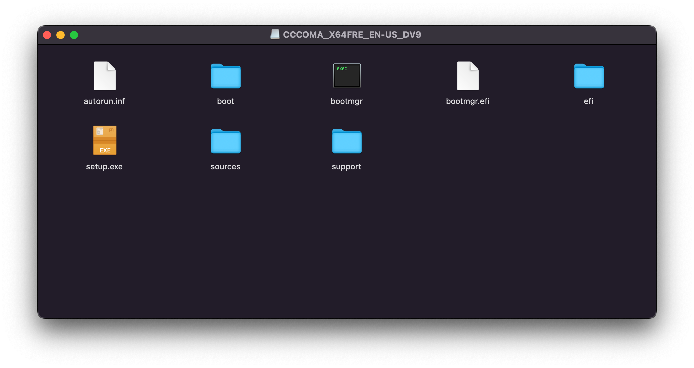

# Mac create Windows Bootable USB 2022

I havent seen much documentation about creating a bootable Windows 10 / 11 USB. So I decided to create my own.

## 🔗 Requirements

- USB (minimum 8 GB)
- Mac running MacOS
- [Windows 10/11 iso file](https://www.microsoft.com/en-ca/software-download/windows10ISO)
- wimlib

## 💾 Step 1: Install Required Software

The first thing we need is the iso file for Windows. It can be downloaded for free from the microsoft website: [https://www.microsoft.com/en-ca/software-download/windows10ISO](https://www.microsoft.com/en-ca/software-download/windows10ISO)

We also need to use Homebrew to install wimlib

```
brew install wimlib
```

## 💽 Step 2: Find & Format USB

We need to run the disk utility to find the USB.

``` 
diskutil list 
```

We should get a result that looks something like this: (**Remeber your USB might not be disk2**)

``` 
/dev/disk2 (external, physical):
   #:                       TYPE NAME                    SIZE       IDENTIFIER
   0:                      FAT32 USBKEY                  16 GB      disk2
```

We need to format the USB to make sure a computer can boot from it. Replace the disk2 with the number of your 

```
diskutil eraseDisk MS-DOS "WIN" GPT /dev/disk2
```

## 👯‍♀️ Step 3: Mount ISO & Copy Files

Mount the iso file. Double click the iso file to mount or run the code to mount it. It should be mounted as something like CCCOMA_X64_FRE_EN-US_DV9. 



Copy the files from the mounted iso file to the USB. This seems 
**You should notice an error that install.wim is too large to copy over to the USB. This will be fixed in the next step.**

## ✨ Step 4: Add Install.wim

The maximum filesize for FAT32 is 4GB and install.wim is ~5 GB in size. To get around this we can use a tool called wimlib to slice up the file into smaller portions.

```
wimlib-imagex split /Volumes/CCCOMA_X64FRE_EN-US_DV9/sources/install.wim /Volumes/WIN/sources/install.swm 4000
```

The parameters of the command are: 
```
wimlib-imagex split 1 2 3
```

1: Location of input file from Mounted ISO (/Volumes/VolumeName/sources/install.wim)

2: Location of file output location on USB (/Volume/USBName/sources/install.swm) The output file format is no longer wim but rather swm for split wim

3: Split size in MB (4000)


## 🧼 Cleanup

Congratulations you've successfully created a bootable Windows 10 USB! Just unmount the drives and you're done.

```
diskutil unmountDisk /dev/disk2
```

