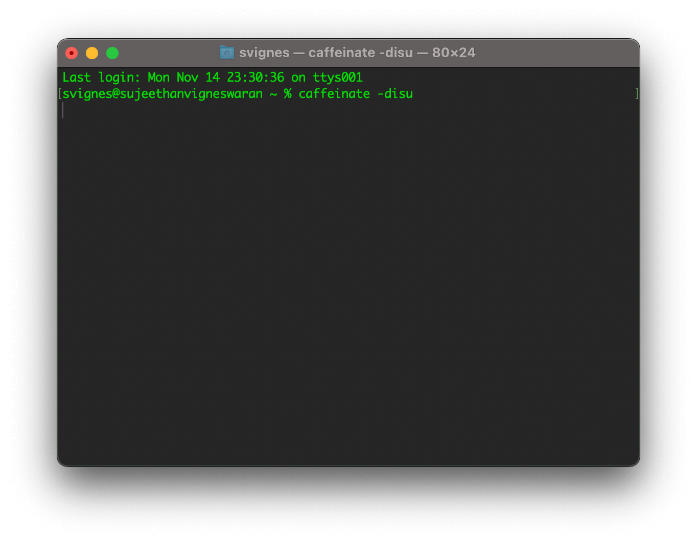
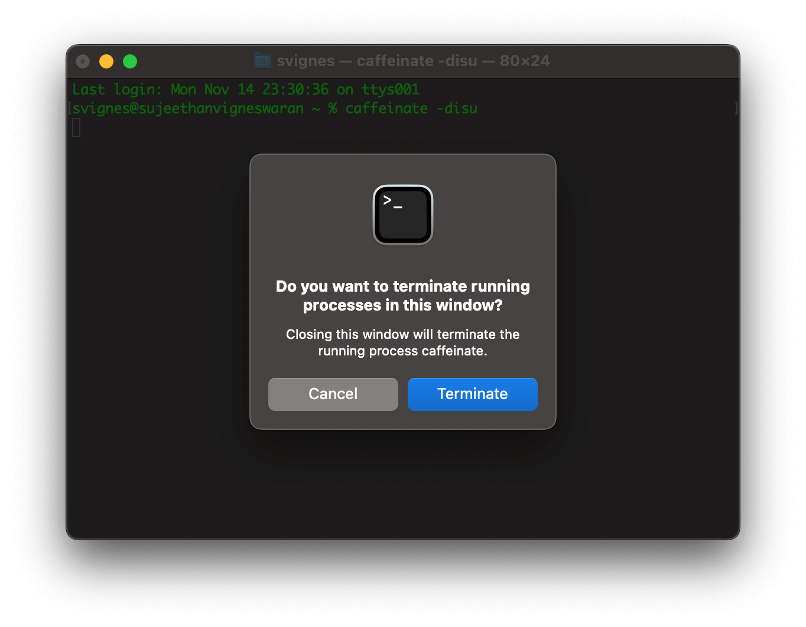

# Mac How To Stop Falling Asleep

Have you wanted to keep your Macbook display running but it keeps falling asleep? This is the solution.

## 🔗 Requirements

- Macbook

## 💾 Step 1: Launch Terminal

First we need to launch the terminal application. 

A quick shortcut is to press Command + Spacebar to pull up Spotlight Search and type Terminal.app. 

Hit Enter to launch the application.



## 💽 Step 2: Run Caffienate

We need to run caffeinate to prevent the Macbook from sleeping. Copy, paste and hit enter to run the command.

``` 
caffeinate -disu
```

In case you're curious the parameters passed to the caffeinate do the following:

-d      Create an assertion to prevent the display from sleeping.

-i      Create an assertion to prevent the system from idle sleeping.

-s      Create an assertion to prevent the system from sleeping if on AC power.

-u      Create an assertion to declare that user is active.

## 🧼 Cleanup

Congratulations you've successfully stopped your computer from falling asleep. 

But now if you want to turn it off simply press the red exit button on the top left of the Terminal application to terminate it.

